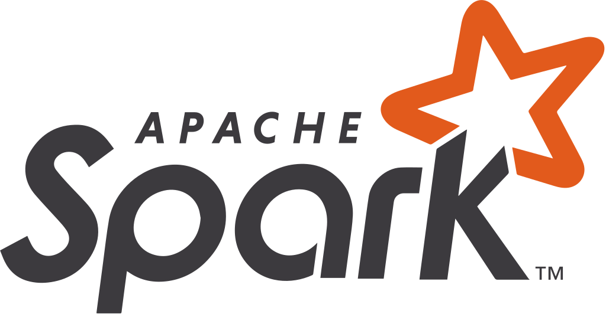
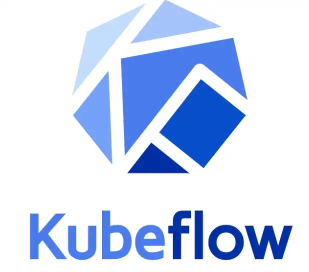

### Hi there 👋

I am Milos, mlops and data scientist with a programming background and 15+ years of experience. Have a strong foundation in ML and computer science and use these skills to solve complex problems.
Here's the little snake that is eating my github contributions:

### Languages and Tools:

 

### Stackoverflow:
 

